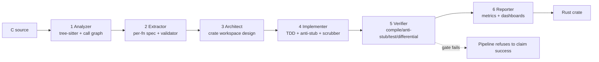

# Alchemist

> **Public OSS. Research-prototype.** Apache-2.0 algorithm-aware C-to-Rust translation that runs entirely on your own GPU. See [PRODUCTION_READINESS.md](PRODUCTION_READINESS.md) for the honest maturity assessment.

[](LICENSE)
[](#requirements)
[](#requirements)
[](#testing)
[](docs/zlib_case_study.md)
[](PRODUCTION_READINESS.md)

---

```bash
$ alchemist translate ./my-c-lib --name my-rs

  [PASS] analyze     78 files, 412 fns, 9 modules
  [PASS] extract     specs OK — 0 constants deviate from RFCs
  [PASS] architect   7-crate workspace validated
  [PASS] implement   TDD: 411/412 fns pass tests; API complete
  [PASS] verify      compile ✓  anti-stub ✓  cargo test ✓  differential (10K/10K) ✓
  [PASS] report      metrics written

  OVERALL: PASS
  wall-time: 11m 42s   cost: $0.00
```

That's the whole pitch. Point it at C, get Rust back that compiles, passes every test, and byte-for-byte matches the original across thousands of random inputs. No rubber-stamping, no "looks right," no `unsafe` by default. If any gate fails the pipeline refuses to claim success.

---

## 🎯 Proven on zlib — byte-exact, in safe Rust

The flagship result: Alchemist translated **zlib** — compressor *and* decompressor — from C into pure safe Rust, and proved it with a **full byte-exact round-trip**.

```
Rust deflate  →  Rust inflate  →  the original bytes        (identical, 21/21)
```

- **`deflate`** byte-exact vs the reference C at levels **1–9** + `Z_HUFFMAN_ONLY` + `Z_RLE`
- **`inflate`** byte-exact on stored, dynamic, and fixed Huffman streams (with LZ77 back-references)
- **Zero `unsafe`.** The whole ~30-state decode machine, `goto`, `union`s, pointer aliasing, and bit-twiddling re-expressed in safe Rust's ownership model.

Why it counts: the differential oracle didn't just translate — it **caught ~9 real integration bugs** that every isolated unit test passed clean over (a whole-state wipe, a shift overflow, a pointer-aliasing gap, and more). That's byte-exact-or-refused doing its job.

**→ Read the full write-up, including honest limitations: [docs/zlib_case_study.md](docs/zlib_case_study.md)**

**Next mountain — any C library, fully automatic: [docs/PATH_TO_AUTONOMY.md](docs/PATH_TO_AUTONOMY.md)** (the charted roadmap).

---

## Table of Contents

- [Why Alchemist](#why-alchemist)
- [How it works (30 seconds)](#how-it-works-30-seconds)
- [Install](#install)
- [Quickstart](#quickstart)
- [The six stages](#the-six-stages)
- [The six gates](#the-six-gates)
- [Architecture](#architecture)
- [Comparison vs alternatives](#comparison-vs-alternatives)
- [Plugins](#plugins)
- [Documentation](#documentation)
- [What's next](#roadmap)
- [Contributing](#contributing)
- [License](#license)

---

## Why Alchemist

DARPA's TRACTOR program and every academic cousin (c2rust, Corrode, CRUST-Bench) treat C→Rust as a **syntactic** problem: walk the AST, emit equivalent Rust. The output compiles. It's also **95-100% `unsafe`** by line count — pointer arithmetic, union punning, and manual memory management have no direct safe-Rust analogue. You get Rust that looks like C wearing a hat.

Alchemist takes the other road. It treats translation as an **algorithmic** problem:

> 1. What is this C function *actually doing*, mathematically?
> 2. What would an experienced Rust engineer write to do the same thing?
> 3. Does the Rust output match the C byte-for-byte across ten thousand random inputs?

If you recover the **spec** first and implement **from the spec**, you get Rust that's safe by construction — not safe because a pattern-matcher happened to catch this case.

The methodology was validated by hand on **Meridian**, a from-scratch Rust re-implementation of ArduPilot at 74,530 lines across 47 crates with 1,200+ tests and full parity. Alchemist is that workflow, automated, with an LLM in the loop and a wall of safety gates around it.

### The three things that make this different

**1. It refuses to ship broken code.** Every stage has a hard gate. The spec validator catches `BASE = 255` before anyone writes a line of Rust. The anti-stub detector rejects `unimplemented!()` and the model's favorite evasion: `// Since we don't have the actual algorithm, we use a simple heuristic`. The differential gate runs 10,000 random inputs through both the C reference and the Rust output. If *any* gate fails, `alchemist translate` exits non-zero with a report telling you exactly which one.

**2. It runs entirely on your hardware.** No cloud API. No per-token bill. No data egress. The reference setup is a single RTX PRO 6000 running Gemma 4 31B Dense via vLLM. Your C source never leaves your LAN.

**3. It's test-driven from the first pass.** Stage 4 is TDD: emit the signatures as stubs, emit failing tests from the standards catalog (RFC 1950 Adler-32 vectors, NIST CAVP AES vectors, etc.), then per-function fill in the real impl with `cargo test` as the supervisor. The model never sees green without actually being green.

---

## How it works (30 seconds)

```
   your-c-lib/                                          your-c-lib-rs/
   ┌──────────┐                                        ┌──────────┐
   │  *.c *.h │──► analyze ──► extract ──► architect ──► implement ──► verify ──► │  Rust    │
   └──────────┘     ▲             ▲             ▲           ▲            ▲        │  workspace│
                    │             │             │           │            │        └──────────┘
                 tree-sitter   per-fn LLM    LLM+validator  TDD loop   4-gate     + proptest
                 (determ.)     + spec-check  (gates)       + anti-    verifier    harness
                                                            stub                  (refuses
                                                                                   silent
                                                                                   success)
```

Every stage is checkpointed in `.alchemist/`. Re-running after a crash picks up where it left off. Each stage can be invoked individually (`alchemist analyze`, `alchemist extract`, …) or via `alchemist translate` for the whole pipeline.

---

## Install

```bash
git clone https://github.com/thornveil-ai/alchemist
cd alchemist
pip install -e .

alchemist doctor
```

`alchemist doctor` verifies your environment — Rust toolchain, C compiler, LLM server, standards catalog, plugins. Expect something like:

```
            alchemist environment check
┏━━━━━━━━━━━━━━━━━━━━┳━━━━━━━━┳━━━━━━━━━━━━━━━━━━━━━━━━━━━━━━━━━━━━━━━━┓
┃ check              ┃ status ┃ detail                                 ┃
┡━━━━━━━━━━━━━━━━━━━━╇━━━━━━━━╇━━━━━━━━━━━━━━━━━━━━━━━━━━━━━━━━━━━━━━━━┩
│ cargo              │ OK     │ ~/.cargo/bin/cargo                     │
│ rustc              │ OK     │ ~/.cargo/bin/rustc                     │
│ gcc                │ OK     │ /usr/bin/gcc                           │
│ local LLM server   │ OK     │ http://your-llm-host:8090/v1 → 200    │
│ standards catalog  │ OK     │ 12 algorithms loaded                   │
│ scrubber           │ OK     │ 30 rules loaded                        │
│ anti-stub detector │ OK     │ loaded                                 │
│ plugins            │ OK     │ 1 loaded: crypto                       │
└────────────────────┴────────┴────────────────────────────────────────┘
```

### Requirements

- **Python** 3.11+
- **Rust** 1.75+ (with `cargo`, `rustc`, `clippy`)
- **A C toolchain** (gcc / clang / MinGW) — needed to build the C reference DLL for differential testing
- **A local LLM server** serving a strong code model. The reference config runs **Gemma 4 31B Dense** via vLLM on port 8090. Any OpenAI-compatible endpoint serving a ≥70B code model works — set `ALCHEMIST_ENDPOINT` to point at it.

No API keys. No network calls outside your LAN.

---

## Quick Start

### Translate a whole codebase

```bash
alchemist translate ./subjects/zlib --name zlib-rs
```

Runs all six stages. Output lands in `./subjects/zlib/.alchemist/output/` as a ready-to-use Cargo workspace. The command exits 0 on success, non-zero on any gate failure.

### Translate one stage at a time

```bash
alchemist analyze   ./subjects/zlib
alchemist extract   ./subjects/zlib
alchemist architect ./subjects/zlib --name zlib-rs
alchemist implement ./subjects/zlib
alchemist verify    ./subjects/zlib ./subjects/zlib/.alchemist/output
alchemist report    ./subjects/zlib/.alchemist/output
```

Each stage is checkpointed — you can re-run just one without re-doing the others.

### Browse the standards catalog

```bash
alchemist standards list           # every algorithm with vectors
alchemist standards show sha256    # dump the vectors + sources
```

### Scaffold a new project

```bash
alchemist new my-translation
cd my-translation
# drop your .c/.h files under ./src
alchemist translate ./src --name my-translation
```

### Debugging overrides (use with care)

```bash
alchemist translate ./src --force        # bypass the architecture validator
alchemist translate ./src --no-verify    # skip the differential gate (NOT for shipping)
alchemist translate ./src --no-tdd       # use the legacy per-file generator
```

---

## The six stages

| # | Stage | What it does | LLM? |
|---|-------|--------------|------|
| 1 | **Analyze** | tree-sitter parses C with full recursive `#ifdef` traversal, builds the call graph, runs Tarjan SCC, detects algorithmic modules with a 21-pattern signature library (CRC variants, Huffman, Kalman, DEFLATE, …). | No |
| 2 | **Extract** | One LLM call per significant function produces a `FunctionSpec`: mathematical description, inputs/outputs in idiomatic Rust types, invariants, preconditions, cited standards, test vectors. **Per-function, never bulk** — bulk extraction on 40 functions returns 128K garbled tokens; per-function crashes safely and checkpoints to `specs/_functions/<mod>/<fn>.json`. | Yes |
| 3 | **Architect** | LLM designs the Cargo workspace: crate boundaries along ownership/cohesion lines, trait hierarchy (`Checksum`, `Compressor`, `Decoder`), error enums with `thiserror` conventions, `no_std` flags per crate. Validator rejects dep cycles, orphan-rule violations, and unassigned modules. | Yes |
| 4 | **Implement** | TDD. Three sub-phases: (A) deterministic skeleton with types + `unimplemented!()` bodies that **must** compile; (B) catalog + spec test emission — tests compile but fail because the bodies are stubs; (C) per-function fill-in loop with `cargo test` as supervisor, anti-stub scrubber, holistic escalation. | Yes (per-fn) |
| 5 | **Verify** | Four gates in order: `cargo check`, anti-stub scan, `cargo test`, differential proptest. Differential auto-generates FFI bindings, builds the C as a DLL, emits a proptest harness with 10K-case strategies per algorithm category (byte-exact for checksum/hash, roundtrip for compression/cipher, ULP tolerance for FP). **Refuses to claim success without this gate.** | No |
| 6 | **Report** | Per-crate metrics: `unsafe` line count, clippy score, proptest pass/fail, head-to-head c2rust baseline comparison. Writes a JSON dashboard. | No |

---

## The six gates

The production bar. Every gate must pass before `TranslationReport.ok == True`.

| # | Gate | Catches |
|---|------|---------|
| 1 | **Spec validator** | Mathematical lies in the extracted spec — "Adler-32 uses `BASE = 255`" when RFC 1950 says `65521`. Cross-checked against the standards catalog at extract time, before any Rust is written. |
| 2 | **Architecture validator** | Dep cycles, orphan-rule violations, modules that don't map to any spec, type producers that don't exist. Rejected before code generation starts. |
| 3 | **Anti-stub** | `unimplemented!()`, `todo!()`, `panic!("not implemented")`, and the model's favorite stealth moves: `// Since we don't have the actual algorithm`, `// For this spec, we simulate the process`, functions that take `&[u8]` input but return `Ok(())` without ever reading the slice. |
| 4 | **Semantic lints** | Code that compiles and runs but implements the wrong algorithm *variant* — a big-endian CRC braid XORing unswapped little-endian table entries, Adler-32 seeded at 0, SHA-256 with little-endian length padding. Family-specific invariants checked against each function's spec, workspace-wide. |
| 5 | **Test gate** | `cargo test --workspace` must exit 0. Tests come from RFC/NIST/IEEE standards, not from the model's imagination. |
| 6 | **Differential gate** | Thousands of random inputs fed through both the C reference (via FFI to a compiled DLL) and the generated Rust, through wrappers generated against the *actual* generated API. A harness that can't be adapted becomes a failing test, never a silent skip. |

Want to ship Rust that's actually correct? All six must be green. Any one fails → the whole translation fails → the pipeline exits non-zero. No exceptions.

---

## Architecture

```
alchemist/
├── analyzer/           Stage 1: tree-sitter + call graph + module detection
├── extractor/          Stage 2: per-fn spec extraction + second-pass validator
├── architect/          Stage 3: crate workspace design + structural validator
├── implementer/        Stage 4: TDD
│   ├── skeleton.py         Phase 4A — types + unimplemented!() bodies
│   ├── test_generator.py   Phase 4B — catalog + spec tests
│   ├── tdd_generator.py    Phase 4C — per-fn loop, anti-stub, splicing
│   ├── anti_stub.py        the "refuses stubs" detector
│   ├── api_completeness.py every source_function must have pub fn
│   ├── scrubber.py         30 deterministic fix rules with tests
│   └── holistic.py         whole-crate escalation fixer
├── verifier/           Stage 5: compile / anti-stub / test / differential gates
│   ├── auto_ffi.py         C → Rust FFI + gcc -shared build
│   ├── proptest_gen.py     per-category harness emission
│   ├── differential_tester.py  the Stage 5 gate itself
│   └── zlib_config.py      reference DifferentialConfig for zlib
├── reporter/           Stage 6: metrics + dashboards
├── standards/          RFC/NIST/FIPS test-vector catalog (JSON per family)
├── plugins/            domain plugins (crypto built-in)
├── llm/                local vLLM client, nonce injection, schema-guided output
├── pipeline.py         run_translate_all — the orchestrator
└── cli.py              alchemist CLI

docs/
├── tutorial.md                   walk-through
├── api_reference.md              programmatic API
├── architecture.md               this diagram + invariants
├── plugins.md                    plugin authoring
├── phase_d_playbook.md           how to declare a translation "verified correct"
└── troubleshooting.md            every failure mode we've seen

tests/                            201 tests pass — unit + live cargo + live gcc
.github/workflows/                CI across Ubuntu + Windows, py3.11 + 3.12
```



See [`docs/architecture.md`](docs/architecture.md) for a detailed walk-through of the data flow, LLM boundaries, and extension points.

---

## Comparison vs alternatives

| System | Input | Safe-Rust % | Verification | Cost | Scale proven |
|--------|-------|-------------|--------------|------|--------------|
| **c2rust** | Any C | **~0%** (100% `unsafe`) | Compile only | Free | Millions of LOC |
| **Corrode** | C99 subset | ~0% | Compile only | Free | Small utilities |
| **ENCRUST** (academic) | Small C utils | ~85% | Test-based | LLM API | Coreutils subset |
| **CRUST-Bench SOTA** (o3 + repair) | Benchmark C | ~60% | Test-based | ~$10/fn | 48% test pass |
| **Alchemist** | **Real-world C libs** | **Target >95%** | **6-gate incl. differential vs C** | **$0** (local GPU) | **zlib 23K LOC + TDD-verified small subjects** |

Alchemist is slower per function than c2rust and costs more upfront (the local GPU). What you get back is Rust you can actually read, review, and ship.

---

## Plugins

Domain-specific safety nets. Built-in plugins:

- **`crypto`** — injects NIST CAVP test vectors for AES/SHA/MD5 at extract time; constant-time lint catches branches-on-secret, `match` on secret u8s, early-return inside secret-iterating loops.

Writing your own is ~15 lines:

```python
from alchemist.plugins import DomainPlugin

def numeric_stability_lint(workspace_dir, specs):
    findings = []
    for rs in Path(workspace_dir).rglob("*.rs"):
        if "f32" in rs.read_text() and "tolerance" not in rs.read_text():
            findings.append((str(rs), 1, "f32_no_tolerance",
                             "f32 usage without documented tolerance"))
    return findings

PLUGIN = DomainPlugin(
    name="numeric",
    description="Flags FP code without tolerance docs.",
    lints=[numeric_stability_lint],
)
```

Register via `pyproject.toml`:

```toml
[project.entry-points."alchemist.plugins"]
numeric = "mypkg.numeric:PLUGIN"
```

`alchemist doctor` picks it up automatically. See [`docs/plugins.md`](docs/plugins.md) for the full contract.

---

## Documentation

| Doc | What you'll find |
|-----|------------------|
| [`docs/tutorial.md`](docs/tutorial.md) | End-to-end walkthrough, typical translation session |
| [`docs/api_reference.md`](docs/api_reference.md) | Python API — call stages directly, inspect reports |
| [`docs/architecture.md`](docs/architecture.md) | Data flow, LLM boundaries, extension points |
| [`docs/plugins.md`](docs/plugins.md) | Plugin authoring contract with crypto example |
| [`docs/phase_d_playbook.md`](docs/phase_d_playbook.md) | Eight-item checklist for declaring a translation "verified correct" |
| [`docs/troubleshooting.md`](docs/troubleshooting.md) | Every failure mode we've hit, with fixes |

---

## Roadmap

Alchemist works end-to-end. The current gap to "100% reliable on any C" is driven almost entirely by LLM disambiguation on multi-variant algorithms (e.g. CRC-32 reflected vs non-reflected). The roadmap closes that.

### Tier 1 — LLM convergence (current)

- [ ] **Reference implementation library** — bundled known-good Rust for Adler-32, every CRC variant, SHA-1/224/256/384/512, MD5, AES-128/192/256, HMAC-SHA256. Injected into the TDD prompt when `referenced_standards` matches. Stop asking the model to invent canonical algorithms.
- [ ] **Variant disambiguator** — one extra LLM hop that forces a single algorithmic variant decision (reflected vs non-reflected CRC, ECB vs CBC cipher mode). Records the decision in the spec.
- [ ] **Multi-sample parallel TDD** — at iteration ≥ 3, sample 4 parallel completions at `temp=0.35`, pick best by test-pass rate. Dramatically widens the search vs current single-sample low-temp.
- [ ] **Decomposed generation** — emit constants → verify → main loop → verify compile → finalization → verify tests. Each sub-step has a narrower correction surface.
- [ ] **Semantic lints per algorithm family** — CRC polynomial/shift-direction consistency, checksum seed-is-consumed, cipher block-size/round-count sanity. Catches "compiled but mathematically wrong."

### Tier 2 — Self-healing pipeline

- [ ] **Test-vector amplification** — once catalog vectors pass, fuzz 100K random inputs via the differential harness. Any mismatch becomes a new `spec.test_vectors` entry and triggers regen.
- [ ] **Architectural search** — run the architect 3× in parallel, validator-score each, pick cleanest.
- [ ] **Escape-valve holistic fixer** — opt-in fallback to a stronger remote model for the ~5% of functions the local model can't solve. Keeps local-first default.
- [ ] **Cross-function regression checks** — after writing fn B, verify fn A still compiles/tests.

### Tier 3 — Long-tail C patterns

- [ ] **Global state rewriter** — deterministic decisions for every C global: `const fn` at compile time, `OnceCell` lazy init, or owned struct field.
- [ ] **Preprocessor pre-parse** — `gcc -E` expand macros before tree-sitter for libraries with heavy `#define` config.
- [ ] **Multi-file refactoring pass** — auto-propose type relocations when cross-crate orphan-rule conflicts recur.
- [ ] **Declarative unsafe fence** — `alchemist.toml` whitelist for modules allowed to use `unsafe`; everything else rejected outright.

### Tier 4 — Scale

- [ ] **Parallelize Stage 4** — independent algorithms generate concurrently. 3-5× wall-time reduction.
- [ ] **Incremental re-runs** — change one C file, re-extract only that file's functions.
- [ ] **Progress events** — structured JSON events for frontend integration.
- [ ] **Domain plugins**: RTOS (FreeRTOS / Zephyr semantics), networking (lwIP state machines), embedded (interrupt handlers, no-alloc).

### Validated so far

- ✅ **Adler-32 (RFC 1950)** — fully generated from C source, verified byte-exact across RFC 1950 test vectors including Wikipedia (0x11E60398).
- ✅ **Fletcher-16** — fully generated + compiles clean.
- ✅ **CRC-32 table init** — correct 256-entry lookup table generated with reflected polynomial 0xEDB88320.
- 🚧 **CRC-32 compute** — failed to converge on tinychk (5 iterations); resolvable once Tier 1.1 lands.

---

## Testing

```bash
pytest tests/ --ignore=tests/test_local_llm.py
# 201 passed in 60s
```

The suite covers:

- **Anti-stub** — 19 tests including "must flag ≥18 stubs in the pre-Phase-A zlib output."
- **Standards catalog** — 34 tests; every vector re-verified against Python `zlib` / `hashlib`.
- **Auto-FFI** — 29 tests including a live `gcc -shared` compile.
- **Proptest harness emission** — 11 tests per category (checksum/hash/cipher/compression/FP/smoke).
- **Differential tester** — 8 tests confirming Stage 5 refuses to claim success without a `DifferentialConfig`.
- **Skeleton** — 12 tests including live `cargo check --workspace` on generated output.
- **Test generator** — 9 tests including end-to-end skeleton → failing tests (the TDD forcing function).
- **API completeness** — 11 tests.
- **TDD generator** — 5 tests; end-to-end with a fake LLM returning a correct Adler-32 produces a passing crate.
- **Spec validator** — 11 tests; BASE=255 and wrong CRC polynomial get caught pre-implementation.
- **Pipeline integration** — 4 tests; full Phase C wiring.
- **Plugins** — 12 tests; crypto CAVP injection + constant-time lint.
- **Phase D (zlib)** — 6 tests; confirm Stage 5 correctly rejects the pre-Phase-A zlib output.
- **Scrubber** — 30/30 tests (every rule has a regression fixture).

Phase A acceptance criteria: **all green.** Phase B acceptance: **all green.** Phase C integration: **all green.** Phase D infrastructure: **all green.** Phase E plugin: **all green.** Phase F docs/CI: **all green.**

---

## Contributing

Pull requests welcome. Before submitting:

1. `alchemist doctor` must print OK across the board.
2. `pytest tests/ --ignore=tests/test_local_llm.py` must pass.
3. New features need a test. The 201-test suite is the floor.
4. The scrubber has 30 rules, each with a regression fixture in `tests/test_scrubber.py`. New scrubber rules follow the same pattern.
5. Domain plugins live in `alchemist/plugins/` with sibling tests in `tests/test_plugins.py`.

Commit style: one concern per commit, imperative mood, no Co-Authored-By or AI attribution. See the existing log for examples.

---

## Prior art and acknowledgments

The algorithm-first methodology was developed and validated by hand on **Meridian**, a from-scratch Rust re-implementation of the ArduPilot autopilot stack — 74,530 lines across 47 crates with 1,200+ tests and full parity verified by a 20-expert review panel. Alchemist is the tooling that makes that workflow reproducible without a human holding the pen.

Thanks to the **DARPA TRACTOR** team for publishing **CRUST-Bench** and framing C-to-Rust rigorously — it gave us something to benchmark against. Thanks to the **ENCRUST** authors for demonstrating that LLM-based translation clears 80%+ safe-Rust on small inputs. Alchemist asks whether that result scales to libraries people actually ship.

Standards-catalog vectors sourced from RFC 1321 (MD5), RFC 1950 (Adler-32), RFC 1951 (DEFLATE), RFC 1952 (CRC-32), FIPS 180-4 (SHA-1/2 family), FIPS 197 (AES), NIST SP 800-38A (block-cipher modes), and independently verified against Python `zlib` / `hashlib` at catalog build time.

---

## License

Apache-2.0. See [`LICENSE`](LICENSE).

---

Alchemist is an experiment in what C-to-Rust could be if we stopped pretending syntax was enough. If you're translating a codebase, try it. If you hit a pattern that doesn't convert cleanly, [open an issue](https://github.com/thornveil-ai/alchemist/issues) — that's how the roadmap grows.

---

A Thornveil system. See [other Thornveil systems](https://github.com/thornveil-ai).
